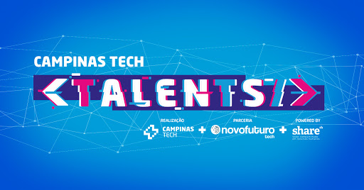
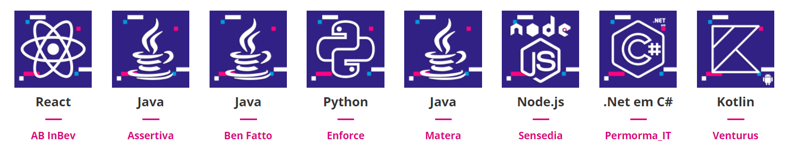
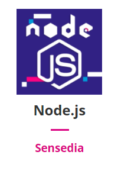
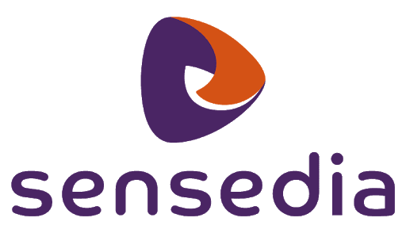

   

# O que é o Campinas Tech Talents?

Um programa de formação e qualificação profissional de novos desenvolvedores nas principais linguagens de programação demandas pelo mercado. O melhor de tudo? É **GRATUITO** e sem sair de casa!

Ao final da formação, além da certificação de participação, os selecionados podem ter a chance de ser contratados pelas empresas apoiadoras.

> Saiba mais clicando [aqui](http://campinas.tech/campinas-tech-talents/)

# Trilhas de formação

Conheça as linguagens de programação ofertadas e a empresa apoiadora de cada uma delas. Escolha a sua preferida para tornar-se um desenvolvedor capacitado pelo programa.

    

# Trilha escolhida

Curso de Node.js oferecida pela [Sensedia](https://www.sensedia.com/)  

  

# Tecnologias usadas

- Htm
- Css
- Bootstrap
- JavaScript
- Node.js
- Nestjs
- Npm
- Express
- Nodemon
- Swagger.io
- API Sensedia

---

 
   

 
  Deixo meu agradecimento especial para todos os facilitadores da trilha <b>Node.js</b>, por sua enorme paciência, comprometimento, dedicação pois foram 168 horas de pura imersão e troca de conhecimento. Todos os dias foram muito bem aproveitado, cheio de códigos e networking.  
Gratidão 💓

